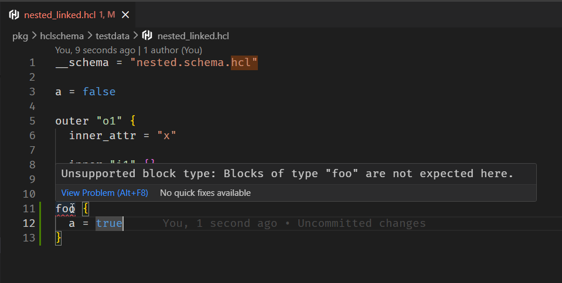

# HCL Schema

Create HCL Schemas using HCL files.

This repository includes:

- **Go library** for validating HCL files according to their `*.schema.hcl` schemas.
- **Go CLI** for verifying HCL files via command-line.
- **VSCode Extension** for verifying HCL files inside the editor.

## Defining Schemas

You can define an schema by creating a `*.schema.hcl`:

**example.schema.hcl**:

```hcl
__schema = "https://raw.githubusercontent.com/avestura/hcl-schema/refs/heads/main/schema/draft/2025-10/.schema.hcl"
__id     = "https://raw.githubusercontent.com/avestura/hcl-schema/refs/heads/main/example.schema.hcl"

body {
    attribute "myattr" {
        required = true
    }

    block_header "tag" {
        label_names = ["name1"]

        body { 
            attribute "x" {}
        }
    }
}
```
Which parses and accepts HCL files like this:

```hcl
// Defines an HCL file like this:

myattr = "x"
tag "name" {
    x = 2
}
tag "name2" {}
```

## Schema Definition

- `block_header` is equivalent of `hcl.BlockHeaderSchema`
- `attribute` is equivalent of `hcl.AttributeSchema`
- `body` is equvalent of `hcl.BodySchema`

### VSCode Extensions

Get the VSCode Extension at [marketplace.visualstudio.com/items?itemName=avestura.hcl-schema](https://marketplace.visualstudio.com/items?itemName=avestura.hcl-schema)



## Root Schema

The [root HCL schema ](./schema/draft/2025-10/.schema.hcl) defines the schema itself (its own body).