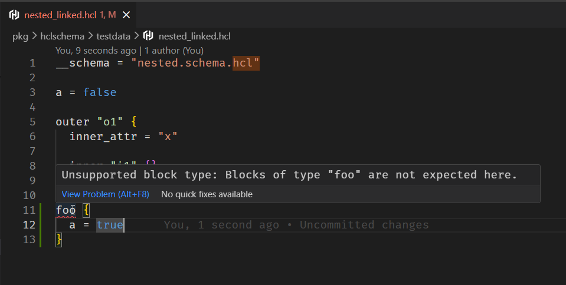

# HCL Schema

:::tip Get it in your editor first

**[Install the VS Code extension →](https://marketplace.visualstudio.com/items?itemName=avestura.hcl-schema)**

Diagnostics as you type, completion of whatever the schema declares, hover
documentation and go-to-definition. The binary ships with it, so there is
nothing else to install. See [Editors](./editors.md).

:::

HCL has no equivalent of JSON Schema. If your tool reads HCL, the shape of that
file lives in your Go code, and the people writing the file find out what it
should contain by reading your source or by guessing.

**hcl-schema** lets you write that shape down, in HCL, as a `*.schema.hcl`
document — and then check files against it, generate reference documentation
from it, and drive editor completion from it.

```hcl title="service.schema.hcl"
__schema = "https://raw.githubusercontent.com/avestura/hcl-schema/refs/heads/main/schema/draft/2026-09/.schema.hcl"
__id     = "https://example.com/service.schema.hcl"

body {
  attribute "name" {
    type        = string
    required    = true
    pattern     = "^[a-z][a-z0-9-]*$"
    description = "The service name, used as a DNS label."
  }

  block_header "listener" {
    label_names   = ["name"]
    min_items     = 1
    unique_labels = true

    body {
      attribute "port" {
        type     = number
        required = true
        min      = 1
        max      = 65535
      }
    }
  }
}
```

```hcl title="service.hcl"
__schema = "./service.schema.hcl"

name = "checkout"

listener "https" {
  port = 443
}
```

```console
$ hclschema validate .
```

## What you get

| | |
| --- | --- |
| **Validation** | Structure, types, value constraints, cardinality and cross-field rules, with HCL's own "did you mean" diagnostics. |
| **Decoding** | The same schema produces an `hcldec.Spec`, so one document both validates and decodes into typed values. |
| **Documentation** | `hclschema docs` turns the `description` fields into a Markdown reference. |
| **Editors** | A language server gives diagnostics on the unsaved buffer, completion, hover and go-to-definition. |
| **CI** | Proper exit codes plus `github` and `sarif` output. |

## In the editor

Everything a schema declares — types, bounds, `enum` values, `description` text
— reaches the person writing the file, as they write it.



<div className="install-cta">
  <a
    className="button button--primary button--lg"
    href="https://marketplace.visualstudio.com/items?itemName=avestura.hcl-schema">
    Install for VS Code
  </a>
  <a className="button button--secondary button--lg" href="/hcl-schema/editors">
    Neovim, Helix and others
  </a>
</div>

## The design in one table

The three core declarations mirror HCL's own types one-for-one:

| hcl-schema | HCL |
| --- | --- |
| `body` | [`hcl.BodySchema`](https://pkg.go.dev/github.com/hashicorp/hcl/v2#BodySchema) |
| `attribute` | [`hcl.AttributeSchema`](https://pkg.go.dev/github.com/hashicorp/hcl/v2#AttributeSchema) |
| `block_header` | [`hcl.BlockHeaderSchema`](https://pkg.go.dev/github.com/hashicorp/hcl/v2#BlockHeaderSchema) |

Those three types are small on purpose — they describe only the *shallow* shape
of a body, because they are the input to `Body.Content()`. Types, defaults and
cardinality live one layer up in HCL, in
[`hcldec.Spec`](https://pkg.go.dev/github.com/hashicorp/hcl/v2/hcldec), and
hcl-schema mirrors that layer too rather than inventing a vocabulary:

| hcl-schema | HCL |
| --- | --- |
| `type` | `hcldec.AttrSpec.Type` |
| `default` | `hcldec.DefaultSpec` |
| `min_items`, `max_items` | `hcldec.BlockListSpec` |
| `required` on a block | `hcldec.BlockSpec.Required` |
| `label` | `hcldec.BlockLabelSpec` |
| `validation` | `hcldec.ValidateSpec` |
| `open` | `hcldec.BlockAttrsSpec` |

A handful of things have no HCL counterpart and are genuinely hcl-schema's own:
`enum`, `pattern`, `min`, `max`, `deprecated`, `sensitive`, the cross-field
constraints, and the `id`/`ref` pair that has been there from the start.

## Self-describing

The meta-schema is itself a `*.schema.hcl` document, and it validates against
itself. There is one language here, not two.

## Next

- [Getting started](./getting-started.md)
- [The schema language](./schema-language/attributes.md)
- [Drafts and compatibility](./drafts.md)
